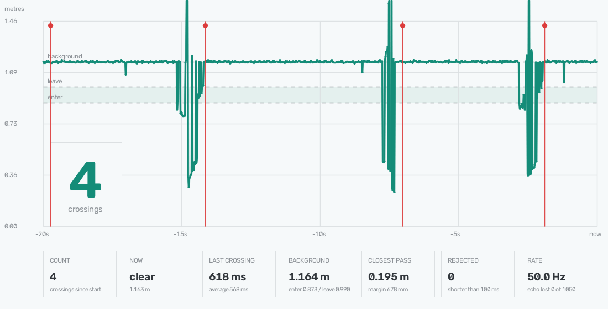
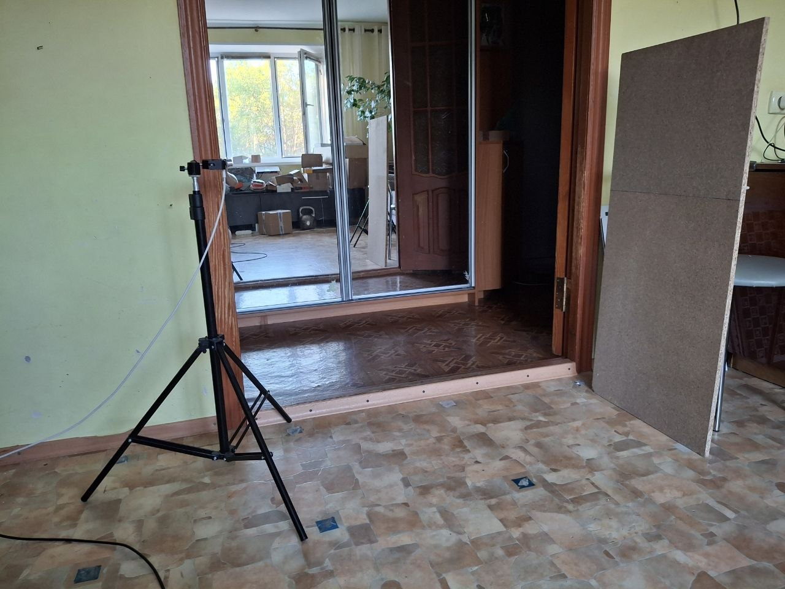

# Example project 3. Counting crossings

**Sensor:** HC-SR04 ultrasonic
**What you get:** a counter that reports how many times something crossed the
beam — and a clear idea of what such a counter can and cannot know.



*Twenty seconds at 50 readings per second. The flat line is the background — a
board 1.17 m away. Each dip is a person crossing the beam; the red marks are the
crossings the example project counted. The pale band between the two dashed lines is the
hysteresis. Four crossings walked, four counted, nothing rejected.*

## Why

No camera, no machine learning, one number per reading: is anything closer than
the background right now? That turns out to be enough to count people through a
doorway — but only once three separate problems are dealt with, and each of them
was found on the bench rather than guessed.

## Problem one: a person flickers

A person is a poor ultrasonic target. Clothing absorbs sound, the body is not
flat, arms and legs move — so while someone walks through the beam the echo
keeps dropping out for a frame or two.

The first version ended a crossing at the first far reading. Result: **38 counts
for 10 walk-throughs.** One person was chopped into four.

Measured on the bench, the two kinds of gap are far apart:

| gap | length |
|---|---|
| inside one crossing | 40–160 ms |
| between crossings | 1.3–7.4 s |

Nothing in between. So a crossing ends only after the view has been clear for
**300 ms** — longer than any flicker, far shorter than any real gap.

## Problem two: a stray echo looks exactly like a person

Example project 1 measured this: a stray echo is always **nearer** than the real target,
6–9 % of readings on a clean bench and up to 70 % with a sofa in the cone. A
single stray reading crossing the threshold is indistinguishable from someone
walking past.

The fix is duration. A stray lasts one reading — 20 ms. A person lasts 400–700
ms, measured. So a crossing has to accumulate **100 ms** near the sensor to be
counted; anything shorter is reported as a rejected blip.

## Problem three: the detection zone is smaller than you think

This one cost the most bench time. The threshold cannot simply be "75 % of the
background", because the background is not a clean number.

A door frame, or any surface the beam grazes at a shallow angle, throws echoes
that land well in front of the real background. With a background of 1.60 m the
empty scene produced strays down to **1.26 m** with nobody in the room. Set the
threshold above that line and the door frame gets counted as a person, forever.

So the example project measures two numbers during the background phase: the background
itself (from the densest cluster) and the **nearest stray** the empty scene
produced. The detection zone ends below the stray line, whatever the fraction
says, and the example project prints which of the two limits won.

The consequence is worth stating plainly: **whoever passes beyond the zone is
not seen at all.** On the doorway bench the zone was 0.87–1.18 m against a
1.60 m background, and people walking at 1.20 m left one reading and were lost.
Not a tuning problem — there was no signal to tune.

## What one sensor cannot do

It counts **episodes of presence**, not crossings.

Walk through the doorway and come straight back, and the sensor sees one
continuous "someone is near", because the cone is about 50° wide and you are
still inside it while turning around. Measured: four crossings walked as two
there-and-back trips produced two episodes, each roughly twice as long as a
one-way pass (1100–1280 ms against 420–860 ms).

There is no fix in software. Direction and crossing count need **two sensors**
side by side — which one fires first tells you which way someone went.

## The cardboard tube experiment

Worth reporting because it failed instructively. To narrow the cone, a cardboard
tube was fitted over the transducers. It changed nothing where it was supposed
to and broke something else:

| | without tube | with tube |
|---|---|---|
| background | 1.601 m | 1.602 m |
| nearest stray echo | 1.259–1.282 m | 1.266 m |

Identical. The stray echoes were never coming from the edges of the cone — they
come from a surface the beam grazes head-on, and a tube cannot help with that.
Meanwhile the narrowed beam started missing people: **two crossings out of four**
were walked straight past it, plus the tube added an echo of its own at a
constant 0.87 m.

The lesson is a trade, not a fix: a wide cone catches everyone but collects
clutter; a narrow one is clean but has to be aimed exactly.

## Running it

```bash
.venv/bin/python examples/03_sr04_counter/sr04_counter.py --temp 30
```

Three seconds of countdown to step out of the beam, two seconds of background
measurement, then it counts. `Ctrl+C` to stop. Add `--plot` for the window.

Flags: `--enter 0.75` and `--exit 0.85` are the thresholds as a fraction of the
background, `--margin 0.10` is how far below the nearest stray the zone must
stay, `--release 0.30` the clear time that ends a crossing, `--min-near 100` the
milliseconds needed to count one.

## How to set it up



*The bench these numbers come from. The sensor sits on a light stand at the edge
of a doorway; the flat chipboard panel opposite is the background, 1.170 m away
by tape. People cross between them. The panel is what makes this setup work — it
is flat, faces the beam head-on and returns a clean echo, so the background is a
sharp number instead of the smeared 1.3–1.6 m a grazed door frame produced.*

Everything above boils down to three rules:

1. **The beam crosses the path**, like a barrier — not along it.
2. **People must pass much closer than the background.** A flat board or wall
   straight ahead is ideal; a door frame the beam grazes is the worst case.
3. **Nobody in the beam during the countdown**, or the background is measured
   against a person and the zone collapses.

## What was verified

Bench of 21 Aug 2026 (photo above): sensor on a stand at one side of a passage,
a flat chipboard panel on the other, 1.170 m apart by tape.

- **background:** the example project measured **1.164 m** against 1.170 m by tape — 6 mm,
  inside the tape's own accuracy;
- **counting:** 4 crossings walked, **4 counted, 0 rejected, 0 false** — with
  2251 background readings in the same run and not one of them mistaken for a
  person;
- **crossing duration:** 419–718 ms, average 568 ms;
- **closest approach:** 0.195–0.359 m, leaving 678 mm of margin to the
  threshold;
- **flicker gaps:** 40–160 ms inside a crossing against 1.3–7.4 s between
  crossings — the basis for the 300 ms release time;
- **there-and-back merging:** confirmed — two round trips produced two episodes,
  not four crossings;
- **stray-limited zone:** confirmed on a doorway, where strays at 1.26 m against
  a 1.60 m background capped the zone at 1.18 m and people passing at 1.20 m
  were missed entirely;
- **cardboard tube:** no effect on strays, two crossings of four missed.
