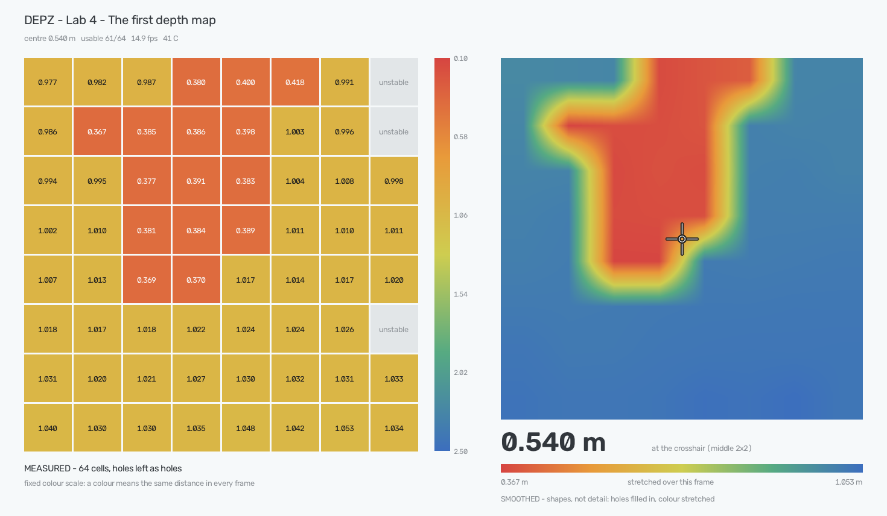
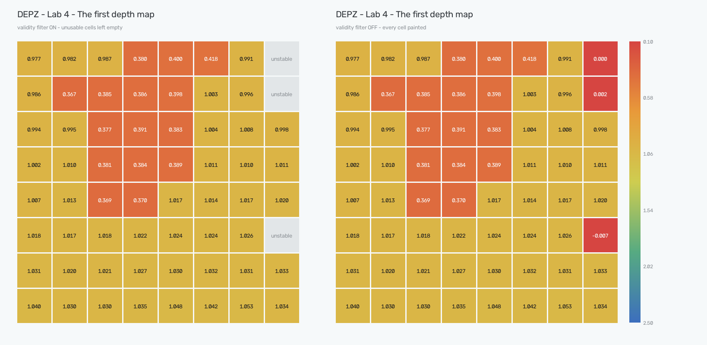

# Example project 4. The first depth map

**Sensor:** VL53L8CH time-of-flight matrix
**What you get:** 64 distances at once — and the three facts that decide whether
those distances mean anything at all.



*What the example project shows when you run it. A hand held 0.38 m in front of the sensor,
a wall an even metre behind it. Left: the 64 measurements, holes left as holes.
Right: the same 64 numbers smoothed into a picture, with the crosshair reading
underneath.*

## Why

The ultrasonic sensor answered with one number. This one answers with 64: an
8×8 grid of tiny laser rangefinders behind a shared lens, each watching its own
narrow slice of the scene, all firing fifteen times a second.

Reading them is not the hard part — the SDK hands over an 8×8 array. The hard
part is that several of that array's properties are not what a first glance
suggests, and every one of them below was found on the bench rather than
assumed.

## The status byte is not optional reading

A cell with nothing in front of it does not report "nothing". It reports a
number, and the number is garbage.

Pointed at a wall with a doorway off to one side, the cells looking through the
doorway came back with `0.000`, `-0.010`, `-0.016` — and, at other moments,
with a perfectly plausible `2.157`. Nothing about the value itself gives it
away. A zero is not obviously wrong; two metres is not wrong at all if there
happens to be a wall two metres down the corridor.

What gives it away is the status byte the frame carries for every cell:

| status | meaning | usable |
|---|---|---|
| 5 | valid | yes |
| 9 | valid, but the return pulse was wide — two surfaces merged | yes |
| 10 | valid, target not seen in the previous frame | yes, but it flickers |
| 4 | the reading disagreed with the previous one | no |
| 6 | first frame — see below | no |
| 255 | no target | no |



*One frame, drawn twice. Left: the three cells aimed at the doorway have nothing
to reflect off and are left empty. Right: the same frame with the filter off —
those cells turn out to hold `0.000`, `0.002` and `-0.007`, and the colour scale
paints them **nearer than the actual hand**. That is what an unfiltered depth map
looks like.*

This example project paints only 5 and 9. Status 10 is a real range too, but it is the first
sighting of something that was not there a frame ago, and on a live map that is
exactly the flicker you do not want painted. `--raw` turns the filter off, which
is the fastest way to see why it exists.

## Two views, because neither one is honest alone

The window shows the same frame twice, and the difference between the halves is
the point.

**The tiles are the data.** 64 cells, each with its number, cells without a
usable reading left empty. The colour scale is fixed at 0.10–2.50 m and never
moves, so a colour means the same distance in this frame and the next — a hand
coming closer does not repaint the wall behind it.

**The picture is the room.** The same 64 numbers, holes filled in from their
neighbours, smoothed up to 600 pixels, and — the part that actually makes shapes
appear — the colour stretched over whatever this frame contains. A room a metre
away spans about 20 cm of depth; on a scale that runs to 2.5 m all of it is one
shade of yellow. Stretched over those 20 cm, the same data uses the whole ramp
and a hand stands out from the wall behind it.

Both halves earn their place, and the picture is the one to distrust. Its
colours mean something different every frame, and the cells it fills in were
never measured — the tiles beside it are what says which is which.

The smoothing itself is deliberately the dull kind. Cubic interpolation looks
better and was tried first, but on a frame with a hand in it 17 % of the pixels
came out either nearer than the nearest measurement or farther than the
farthest: the overshoot at every edge draws a halo that is not in the data.
Linear leaves visible facets and invents nothing.

What smoothing cannot do is add resolution — see the last section for how
little there is. The picture shows **where** things are, never what they are.

## The first frame is empty, and that is correct

Start ranging and the first frame arrives with all 64 cells stamped status 6.
Nothing is broken. The sensor checks every reading against the previous one, and
on the opening frame there is no previous one.

It costs one frame out of fifteen per second, so live modes simply paint it as
an empty grid for a sixteenth of a second. `--flat` drops it and says so —
counted as a sample, that one frame would make every single zone look like it
had dropped a reading.

## The grid arrives turned a quarter turn

Zone 0 is a corner of the sensor die, not the top-left of the scene. On this
board the raw index runs down the **right** edge of the field first.

This was measured, not read off a datasheet. The bench scene was a wall a metre
away with a doorway opening to the right, and the wall's top-left corner leaning
slightly towards the sensor:

- the cells with no return — the doorway — arrived in raw **row 0**;
- the nearest cell of all — the leaning corner — arrived at raw **(7, 0)**.

Two facts, and between them the eight possible ways to lay out the grid collapse
to one: rotate the raw array a quarter turn clockwise and the map reads the way
a person standing behind the sensor sees the room, row 0 at the top, column 0 on
the left. That is the whole of `GRID_QUARTER_TURNS` in the code.

Then it was confirmed the other way round, by putting a hand somewhere known and
seeing where it came out. A hand held to the left of the axis filled **columns
0-3, every row** — a vertical stripe down the left of the map, which is what a
hand and the forearm behind it look like when the field is only 25 cm wide at
that distance. Up and down was checked in the live window, where the red patch
moves the same way the hand does.

That forearm is worth knowing about before designing anything on top of this
sensor: at half a metre the whole field is 41 cm across, so an arm reaching in
does not point at a zone, it fills half the map.

## Is a flat wall flat?

The zones fan out. The lens covers 45° by 45°, split into 8 columns and 8 rows
of 5.62° each, so the corner zone looks 27° off the sensor's axis.

That matters more than it sounds. If each cell reported the distance along its
own slanted line of sight, a wall that really is flat would arrive as a bowl:
the corner cell has to look 1/cos 27° = **12 % farther** to reach the same wall.
At a metre that is twelve centimetres — impossible to miss, and impossible to
ignore when the next example projects start comparing cells against each other.

`--flat` measures it. Zones are grouped into rings by how far off-axis they sit,
and each ring is averaged — a sensor not perfectly square to the wall lifts one
side of a ring by as much as it drops the other, so the tilt cancels and the
slant, which lifts the whole ring at once, does not.

Wall at 1.000 m by tape, 60 frames:

| ring | off-axis | measured / centre | 1/cos, if it were along the ray |
|---|---|---|---|
| 1 | 4.0° | 1.000 | 1.002 |
| 2 | 9.9° | 0.999 | 1.015 |
| 3 | 16.1° | 0.999 | 1.042 |
| 4 | 22.3° | 0.998 | 1.082 |

The outer ring should have been 8 % farther. It is 0.2 % nearer. **The sensor
projects every reading onto its own axis before handing it over** — a flat wall
arrives flat, and cells may be compared with each other directly. Nothing in
this series needs a cosine correction.

## Checked against a tape

Same run, wall at 1.000 m measured from the front face of the board:

| | |
|---|---|
| centre 2×2 | **1.009 m** — 9 mm long |
| noise per zone over 60 frames | 4.3 mm typical, 15.1 mm worst |
| zones reporting in all 60 frames | 53 of 64 |

The eleven unreliable zones are the ones aimed at the doorway, flickering
between a far wall and no target at all — exactly what the status byte is for.

Nine millimetres is close enough that it could be the tape rather than the
sensor: the ranging zero is the cover glass, not the board edge, and a metre
measured to a board held by hand is not a metre measured to a lens.

## Why there are blobs and not contours

The first thing anyone asks after seeing the smoothed picture is why the shapes
are so vague. It is not the smoothing. It is the size of one cell.

The field is 45° wide whatever the distance, so it opens out as a fixed fraction
of the range, and so does every cell in it:

| distance | width of the whole field | width of one cell |
|---|---|---|
| 0.25 m | 0.21 m | 2.6 cm |
| 0.50 m | 0.41 m | 5.2 cm |
| 1.00 m | 0.83 m | **10.4 cm** |
| 2.00 m | 1.66 m | 20.7 cm |
| 4.00 m | 3.31 m | 41.4 cm |

At a metre, one cell is a 10 cm square. Anything narrower than that — a chair
leg, a wrist, the edge of a table — cannot have an outline here, because there
is no measurement narrower than 10 cm to draw it with.

And a cell that straddles an edge does not report the edge. It reports one
number for its whole cone, somewhere between the near thing and the far thing;
the sensor flags those cells status 9, "wide pulse". So even at full resolution
the boundary of an object is smeared across an entire cell before any drawing
starts.

None of this is fixable downstream. Smoothing 64 measurements produces a
smoother 64 measurements. Modules whose depth pictures show a recognisable
chair are not drawing better — they have a hundred points across where this one
has eight.

What this sensor is good at is the other question: not what shape is there, but
**how far away it is**, 64 times at once, to a few millimetres. The next example projects
are built on that, not on outlines.

## Run it

```bash
.venv/bin/python examples/04_tof_depth_map/tof_depth_map.py                 # live map in a window
.venv/bin/python examples/04_tof_depth_map/tof_depth_map.py --raw           # validity filter off
.venv/bin/python examples/04_tof_depth_map/tof_depth_map.py --truth 1.000   # centre against a tape
.venv/bin/python examples/04_tof_depth_map/tof_depth_map.py --flat          # point at a flat wall
.venv/bin/python examples/04_tof_depth_map/tof_depth_map.py --terminal      # text map, for ssh
```

The window is the default here, where the ultrasonic example projects default to text. Sixty
four numbers refreshed fifteen times a second are a picture, and a picture read
as a table of digits is not read at all. Over ssh there is no window to open, so
the example project notices and prints the text map instead.

The first second of every run is silent: the sensor boots with no firmware of
its own, and ~84 KB of it is pushed over USB before ranging can start.
