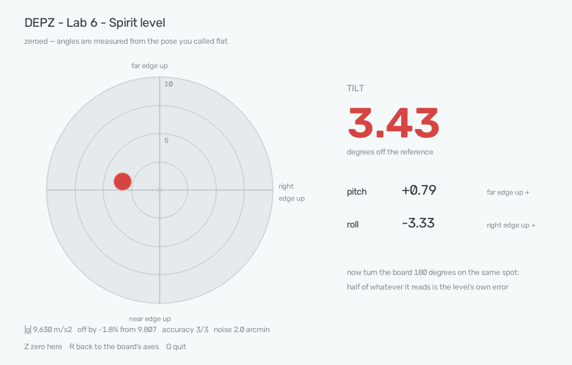

# Example project 6. A spirit level

**Sensor:** BNO086 IMU
**What you get:** tilt in degrees, from the one thing an IMU knows for free —
which way is down. Verified against a tape measure to 0.6°, and the story of
where that 0.6° comes from.



*What the example project shows when you run it — the wedge measurement from further down
this page. The board rests on a plank that was declared flat with the Z key,
and one end of the plank has since been raised by 0.056 m over its 0.794 m.*

## Why

The first three example projects measured distance and the fourth measured 64 distances at
once. This sensor measures nothing you can put a tape on. It reports
orientation — and orientation is where beginners lose a week, because the
obvious way in is the quaternion, and the quaternion is the one output that is
wrong when you switch the board on.

So this example project starts one step earlier, with the part that is trustworthy from the
first report: **gravity**.

The accelerometer feels it always, everywhere, as a push of about 9.8 m/s²
pointing up — the table shoving the board upwards to stop it falling. The chip
separates that steady push from whatever else is shaking the board and hands it
over as three numbers: the direction of "up", written in the board's own axes.
Tip the board and those three numbers swing. The angle they swing through is
the tilt.

Nothing else is needed. No magnetometer, no calibration, no quaternion — those
begin in example project 7. One report, and the sensor is already useful:

```python
dev.enable_gravity(hz=50)
for rep in dev.reports(sensors=SensorId.GRAVITY):
    ...  # rep.x, rep.y, rep.z — where "up" is, in board coordinates
```

## The board's axes, measured rather than assumed

Example project 4's depth map arrived rotated a quarter turn from what the datasheet
suggested, so nothing here is taken on trust either. Board flat on the table,
chip up, USB cable towards you:

| what was done | which number moved | conclusion |
|---|---|---|
| left lying flat | Z = +9.645 | **+Z** points up, out of the board |
| far edge lifted | Y grew by +2.731 | **+Y** points away from you |
| right edge lifted | X grew by +5.583 | **+X** points to your right |

An ordinary right-handed set, in the orientation you would guess — pleasantly
dull after the ToF matrix. Worth repeating on your own board all the same: turn
it, watch which number moves. It takes a minute and it is the only way to know.

Note the direction of the change. Lift the **right** edge and the "up" vector
gains a component towards the **right** of the board, not away from it. That is
why the bubble in the window drifts towards the raised edge, exactly like the
air pocket in a glass tube: both are showing you where the high side is.

## The level does not know what level is

The sensor knows where down is. Whether your table is horizontal is not its
business, and it has no opinion about it.

That is not a shortcoming to be worked around — it is how every spirit level
works. Rest one on a shelf and it does not tell you about the shelf in the
abstract; it compares the shelf to gravity. The example project does the same, with one
addition: pressing **Z** declares the current pose flat, and every angle after
that is measured from *that* surface rather than from the board's own +Z.

The maths is three dot products. The reference direction is called up; the
board's +X axis with its along-up part removed gives right; up crossed with
right gives forward. Then:

```
roll  = atan2(component along right,   component along up)
pitch = atan2(component along forward, component along up)
tilt  = angle between "up now" and "up at zeroing"
```

Tilt is **not** pitch plus roll. Two tilts at right angles combine like the
sides of a right triangle: a board leaning 3° forward and 4° sideways is 5° off
level.

The length of the vector divides out of all three — an angle is a ratio between
components, so it does not care whether the vector is 9.8 long or 9.5. That
turns out to matter, because on this board it is not 9.8.

## Checked against a tape

A level can be checked with arithmetic instead of another level. Rest the board
on a straight plank, lift one end by a known amount, and the angle follows from
a right triangle: the rise, divided by the length of the plank, is the sine of
the tilt.

Zeroed on the flat plank first, then the same plank propped up twice:

| rise | plank | angle it really is | sensor said | error |
|---|---|---|---|---|
| 0.056 m | 0.794 m | 4.045° | 3.43° | −0.61° |
| 0.247 m | 0.789 m | 18.244° | 17.60° | −0.64° |
| 0.247 m | 0.768 m | 18.753° | 18.13° | −0.62° |

The rows say more together than any of them says alone, because there are two
completely different ways a level can lie and a second angle tells them apart:

- a **scale** error stretches the readings, so it grows with the angle;
- a **zero** error shifts them all by the same amount, whatever the angle.

The error here is the same 0.6° at 4° as at 18°. Fitting a line through the
three points gives a slope of **0.9987** — the scale is honest to 0.13%, which
at 18° is a minute and a half — and an offset of **−0.61°**, which is the whole
of the error.

Take the shape of that seriously before reaching for a correction. A sensor
whose scale is right and whose zero is out is a sensor you can fix by pressing
Z on a surface you trust; one whose scale is wrong needs a second known angle
and arithmetic. Two rows in a table decide which of those two afternoons you
are about to have.

## Checking a level with itself

There is an older trick, and it needs no tape at all: put the level down, read
it, then turn it 180° on the same spot and read it again.

A perfect level reads the same both ways. An imperfect one has its own error
added on one heading and subtracted on the other, so the difference between the
two readings is **twice** its error — and this works no matter how crooked the
surface is, because the surface contributes equally to both.

Zeroed, then turned end for end: **1.21°**, so the level's own error is
**0.60°**.

That is a third measurement, independent of the two in the table above, and it
lands on the same number. The 0.6° is real.

## Where the 0.6° comes from

The bottom line of the window shows the length of the gravity vector, and this
is the sensor confessing. Gravity is 9.807 m/s² and the board cannot change it,
so that length must read the same in every pose. It does not:

| pose | \|g\| |
|---|---|
| flat on the table | 9.630–9.671 |
| far edge lifted | 9.526 |
| tilted 18° | 9.465 |
| standing on its side | 9.920 |

A spread of 3.5% in a quantity that is not allowed to change at all. The cause
is an **offset**: each of the three accelerometer axes adds a small constant of
its own to whatever it measures. Add a fixed vector to gravity and you get a
vector of the wrong length — and, more to the point here, pointing slightly the
wrong way. About 0.2 m/s² of offset against 9.8 of gravity is 1.2°, and after
zeroing takes out the part that is common to both poses, 0.6° of it survives.

This is also why the `accuracy` field in the window is not the answer. It reads
3 of 3 for the gravity vector — the fusion is doing fine — while the level is
still 0.6° out. The accuracy field grades the algorithm, not the metal.

The obvious thing to try is waving the board about, since that is what fixes
the magnetometer. It does not help here: fifteen seconds of turning the board
through every axis, then zeroing and measuring again, produced the third row of
the table — the same 0.62°, and \|g\| still 9.475 in that pose. The offset the
chip corrects in the background is not the one costing us half a degree, and no
amount of arm-waving reaches it.

Half a degree is 1 cm over a metre. For hanging a shelf, checking a camera rig
or telling a slope from a wobble, it is fine. For anything finer the offset has
to be measured against known directions and stored on the chip, which is
calibration proper — example project 7.

## What "steady" looks like

With the board untouched on a table, the reading wanders by **4–5 arcminutes**
(0.07–0.08°), reported live in the window as `noise`. That is the honest
resolution of this level.

The example project calls a surface level below 0.20°, a threshold set a little above the
noise so a still board reads LEVEL steadily instead of flickering. It is a
choice, not a measurement: a builder's spirit level is graded around 0.5 mm/m,
which is 0.03° — well past what this sensor can see.

## Run it

```bash
.venv/bin/python examples/06_imu_level/imu_level.py                       # live bubble in a window
.venv/bin/python examples/06_imu_level/imu_level.py --range 5             # finer scale, ±5°
.venv/bin/python examples/06_imu_level/imu_level.py --zero                # start already zeroed
.venv/bin/python examples/06_imu_level/imu_level.py --check               # average one pose, print it
.venv/bin/python examples/06_imu_level/imu_level.py --check --truth 4.045 # against a known wedge
.venv/bin/python examples/06_imu_level/imu_level.py --terminal            # text readout, for ssh
```

In the window: **Z** declares the current pose flat, **R** goes back to the
board's own axes, **Q** quits.

The window is the default, as in the ToF example projects. Two angles would read perfectly
well as text, but a bubble shows the direction of the lean at a glance, which
is the whole reason spirit levels have bubbles. Over ssh there is no window to
open, so the example project notices and prints the text readout instead.
