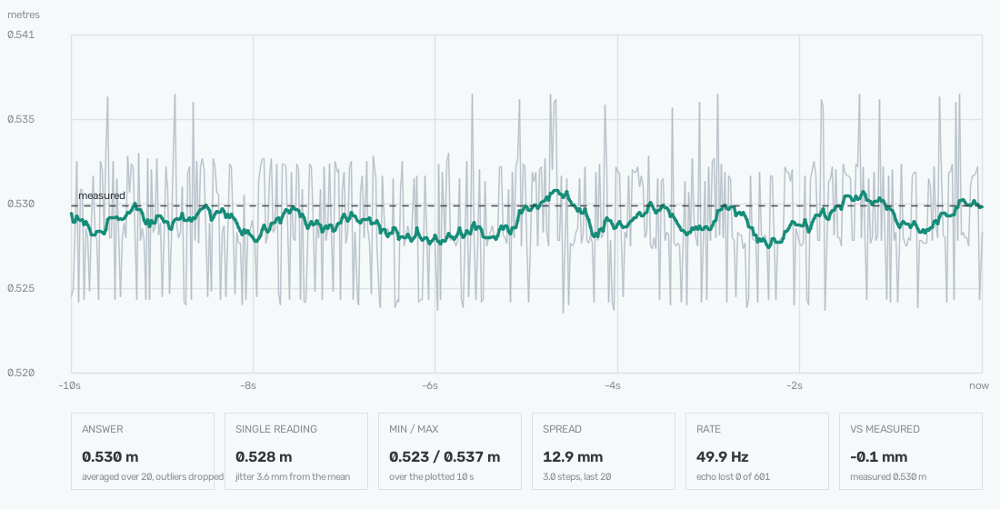

# Lab 1. An honest ruler

**Sensor:** HC-SR04 ultrasonic
**What you get:** a distance that agrees with a tape measure, and a clear idea
of how many readings that takes — and when the sensor cannot be trusted at all.



*Ten seconds of a sensor pointed at a wall 0.530 m away. The pale comb is the
raw readings — the same thing the DEPZ viewer shows. The green line is this
lab's answer: averaged with outliers dropped. Same sensor, same moment: the comb
covers 12.9 mm — three resolution steps — while the answer holds the dashed line
of the measured distance to within 0.1 mm.*

## Why

An ultrasonic sensor looks simple: send a click, wait for the echo, halve it. In
practice a single reading is almost always wrong, and wrong for three different
reasons at once. This lab takes them apart one at a time and ends with a number
you can check yourself.

## How the sensor measures

The transducer clicks at 40 kHz and listens. The board times how long it takes
for the returning sound to cross a threshold and reports that in microseconds.
We turn it into a distance ourselves: time times the speed of sound, halved —
the sound travelled to the object and back.

The speed of sound depends on air temperature: 331 m/s at zero, gaining about
0.6 m/s per degree. At 20 °C that is 343 m/s. Across four metres, a cold room
and a hot one differ by six centimetres, so the temperature is a flag: `--temp`.

## Reason one: the resolution step

One wave period at 40 kHz lasts 25 microseconds. When the echo is loud, the
threshold is crossed on the same wave every time and readings barely move. When
the echo is weak, its loudness hovers around the threshold and the sensor
triggers on one wave, then on the next. The result jumps by exactly one period:

    343 m/s × 25 µs ÷ 2 ≈ 4.3 mm

Halved for the same reason — the round trip. That is the **step**: no single
reading can be finer than it.

**Measured on the bench.** Readings fell into two clusters, 0.0955 m and
0.0998 m, 4.46 mm apart against a predicted 4.3 mm. Confirmed.

The jitter has an upside. If the truth sits between two steps, the sensor lands
on the upper one more often the closer the truth is to it. So **the average of
many readings settles between the steps** and beats a single one: averaging 100
readings shrank the spread from 4.5 mm to 0.3 mm.

## Reason two: it does not see what you point it at

The sensor looks through a cone of about 50° and answers about the **nearest**
object inside it, no matter where the axis points. At one metre that cone covers
a circle nearly a metre across; at 1.5 m, a metre and a half.

Hence the rule: a stray object can only pull the reading **shorter**. A reading
"farther than the target" has nowhere to come from.

**Measured on the bench.** Against a wall at one metre, 6–9 % of readings were
strays and every single one was nearer than the target. Moving the sensor back
to 1.55 m brought a sofa at the foot of the wall into the lower edge of the
cone: strays jumped to 70 %, smeared from 0.8 m to 1.5 m. The wall kept giving
its own narrow peak throughout.

That is why the lab takes its answer from the **densest cluster, not the
median**. The target alone reflects consistently and forms a narrow peak, while
a sofa, a desk grazed edge-on or a door frame smear out. On the sofa bench the
median missed by 0.10 m and the plain average by 0.13 m; the cluster gave the
correct 1.515 m.

The price of that rejection is sample size. On a short block the densest cluster
can settle on a stray reflection, and then it loses to a plain average. The lab
prints the point where it becomes reliable: about 50 readings on a clean bench,
100 with the sofa in view.

## Reason three: scale and origin

Even with a single target and plenty of data, a gap against the tape remains. It
has two parts, and telling them apart needs **two** distances:

- **a constant offset** — the same at any range. Everything geometric lives
  here: a misaimed axis, and the fact that the sensor measures the shortest path
  to the wall while the tape runs along its own line;
- **a scale error** — growing proportionally. Either the air temperature is
  wrong, or the board's clock drifts.

Separate them like this: measure, move the sensor a known distance **without
turning it**, measure again. Everything constant cancels in the difference and
only the scale is left.

**Measured on the bench** (21 Aug 2026, room at 30 °C):

| tape | lab at `--temp 20` | error | lab at `--temp 30` | error |
|---|---|---|---|---|
| 1.050 m | 1.020 m | −29.9 mm | 1.039 m | −10.6 mm |
| 1.550 m | 1.516 m | −34.4 mm | 1.541 m | −9.3 mm |

This is the payoff. With the temperature left at its default the sensor read
2.3 % short, which looked exactly like a scale error — a drifting board clock.
But the room was at 30 °C, not 20: sound travels 349.5 m/s there instead of 343,
1.9 % faster. Passing `--temp 30` dropped the gap from 35 mm to 9.

What remains is visible in the table: **about −10 mm at both distances**. Equal,
therefore an offset and not a scale error. The board's clock is honest, so is
the speed of sound now, and those ten millimetres are the bench geometry: a
misaimed axis, and the shortest path versus the tape's own line.

An honest caveat: a 500 mm baseline is short for a claim about scale. The tape
is good to ±3 mm, which is 0.6 % of the baseline. The conclusion holds because
the remainder is the same at both points, but a three-metre baseline would
settle it properly.

## Running it

```bash
.venv/bin/python labs/01_sr04_ruler/lab1_sr04.py --temp 30
```

Live reading: the single value, the answer with outliers dropped, the plain
average and median for comparison, the window spread, jitter and a count of
missing echoes. `Ctrl+C` to quit.

A window with a time plot instead of the terminal:

```bash
.venv/bin/python labs/01_sr04_ruler/lab1_sr04.py --temp 30 --plot
```

Three things are drawn at once: the raw readings as a pale comb, the answer as a
solid line, and every reading the rejection discarded as a red dot. Add
`--truth` and the measured distance shows up as a dashed line, so you can see
whether the answer sits on it or beside it. `q` or `Esc` closes the window.

The tiles below the plot deliberately cover different time spans, so they answer
different questions:

| tile | what it says |
|---|---|
| ANSWER | the averaged answer, outliers dropped |
| SINGLE READING | the latest raw value, and how far a reading typically strays from the mean |
| MIN / MAX | the extremes across the whole plotted 10 s, strays included |
| SPREAD | how much it wavers right now, over the averaging window alone |
| RATE | readings per second, and how many echoes came back empty |
| VS MEASURED | the gap against `--truth` |

The terminal modes work without OpenCV; only `--plot` needs it.

Compare against a tape measure (metres):

```bash
.venv/bin/python labs/01_sr04_ruler/lab1_sr04.py --temp 30 --truth 1.550
```

How much averaging you need:

```bash
.venv/bin/python labs/01_sr04_ruler/lab1_sr04.py --temp 30 --study
```

Collects a sample set (hold the sensor still), draws a histogram — the steps and
the stray reflections are both visible there — and builds a table of how far the
answer wanders when averaged over N readings, with and without rejection.

Flags: `--temp 30` air temperature, `--window 50` averaging window in live mode,
`--blocks 1` a shorter sample set, `--port /dev/ttyACM0` if several boards are
plugged in.

## Worth knowing

- **Soft and slanted surfaces do not reflect.** Fabric, foam and curtains
  swallow the sound; a flat surface tilted by more than about 15° sends the echo
  away. The tell-tale sign is the "echo lost" line.
- **Below two centimetres the sensor is blind:** the transducer is still ringing
  and drowns the echo.
- **A doorway is a black hole:** the sound leaves and never comes back.

## What was verified

Bench: board on a desk, aimed at a flat patch of wall, sofa at the foot of the
wall. Distances measured with a tape to the front rim of the transducer
cylinders, good to ±2–3 mm.

- **step:** 4.3 mm predicted, 4.46 mm measured — confirmed;
- **thickness of a ChArUco board in front of the wall:** the sensor reported a
  10.2 mm difference between readings with and without it. The board itself is
  6 mm and did not sit flush against the wall — the remaining ~4 mm is the gap.
  Confirmed;
- **stray reflections:** 6–9 % at one metre, 70 % at 1.55 m because of the sofa;
  every one of them nearer than the target, exactly as the cone predicts;
- **temperature:** the room was at 30 °C; with `--temp 30` the error fell from
  35 mm to 9 — three quarters of the "sensor error" was a wrong speed of sound;
- **scale from two points:** after the temperature fix the remainder is the same
  at both distances (about −10 mm), so the scale is right and the offset
  constant;
- **readings needed:** 50 on a clean bench, 100 with strong interference;
- **the plot window** (screenshot above) is a real capture from this bench, not
  a mock-up: the raw comb covers 12.9 mm — three resolution steps — at 50 Hz,
  while the averaged answer sits **0.1 mm** from the measured 0.530 m. That is
  closer than the tape can be read, so treat it as "within tape accuracy"
  rather than as a hundredth of a millimetre of truth.
