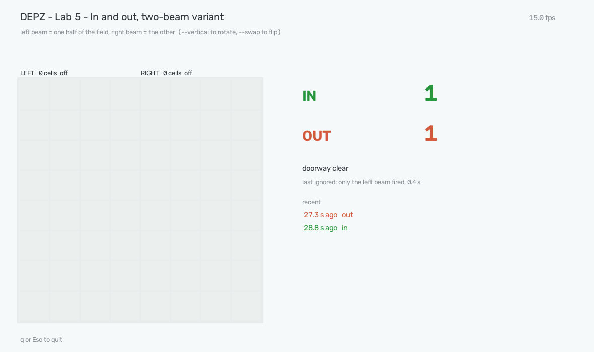

# Lab 5 — In and out: a two-beam counter (VL53L8CH)

**Sensor:** DEPZ ToF VL53L8CH USB (`1bcf:ed40`) · **Time:** 10 minutes

Lab 3 counted people through a doorway with one ultrasonic beam and ended with
a limitation: one sensor counts *episodes of presence*, not crossings, and it
cannot tell left from right. Its README says the fix needs two sensors side by
side — whichever fires first tells you the direction.

This lab keeps that promise with one board. The 8×8 matrix is split into two
**virtual beams** — the left four columns and the right four. Each beam is
nothing more than the presence detector from lab 3, and the counter only
remembers two things per crossing: which beam saw the person first and which
saw them last.

| first on | last off | outcome |
|---|---|---|
| left | right | **in** |
| right | left | **out** |
| anything else | | ignored — one beam only, both at once, too short |

Two numbers on the screen, nothing else: a doorway counter that reports
"maybes" is a counter nobody reads.

`--swap` flips in and out if the sensor is mounted the other way round.
`--vertical` cuts the matrix into a **top** and a **bottom** beam instead, for a
board mounted so that people cross the field top-to-bottom.

## Which way is the board pointing?

Nobody can tell from the USB connector: lab 4 found the grid's orientation with
a hand in the live window, not from the board's markings, and did not record
how the board was held. So find out the same way — it takes ten seconds:

1. Start the lab, let it learn the background, then wave a hand slowly across
   the doorway the way a person would walk.
2. Watch the green patch. If it travels **left-to-right** across the columns,
   the default layout is right. If it travels **top-to-bottom**, restart with
   `--vertical`.
3. Walk through once in the "in" direction. If the lab says **out**, add `--swap`.

Symptom of the wrong layout: nothing ever counts, because the person lights
both beams at once instead of one after the other.

There is a second lab 5 next door (`05_tof_direction`) that tracks the centre
of the person across all eight columns. That one sees more; this one is
simpler to reason about and to debug, and it is the one to read first.

## Run

```bash
.venv/bin/python labs/05_tof_direction_f/lab5_tof.py               # live window
.venv/bin/python labs/05_tof_direction_f/lab5_tof.py --swap        # in/out backwards?
.venv/bin/python labs/05_tof_direction_f/lab5_tof.py --vertical    # people cross top-to-bottom
.venv/bin/python labs/05_tof_direction_f/lab5_tof.py --terminal    # text, for ssh
```

The lab spends the first three seconds (`--background`) learning the empty
doorway — stand clear. Then walk through.



## What makes it work

Every constant in the file exists because the bench demanded it:

- **Per-cell background, and a lenient one.** Aimed across a room, only 17 of
  64 cells answered reliably; the rest looked at surfaces 2–3 m away that answer
  now and then. Treating "answers sometimes" as "open space" turned every stray
  answer into an object: an empty room fired the left beam five times in twelve
  seconds. A cell that answers in ≥ 10 % of the background frames now keeps a
  background (its median), and only a cell that never answers counts as open
  space.
- **Two frames in a row.** A cell has to be covered in two consecutive frames
  (`PERSIST_FRAMES`) to count. A stray reading lasts one frame; a person does not.
- **Direction from timestamps, not from states.** The first version waited
  for a frame in which exactly one beam was on to know where the person was.
  A fast walker is out of the first beam before its 300 ms release lets go, so
  both beams look "on" for the whole crossing and no order is ever seen — real
  walks came out as "turned back" or "rejected". Now each beam remembers when
  it switched on and off, and the crossing is read as *first on* → *last off*.
- **Runners get a second opinion.** At 15 fps a runner crosses the field in
  six to eight frames and often lights both beams in the same frame — no
  "first". Walking counted fine, running had gaps. So the lab also remembers
  where across the field the covered cells sat in the first and the last frame
  of the crossing; when the beams cannot say, a move of ≥ 3 lines
  (`MIN_TRAVEL_LINES`) decides the direction instead.
- **Hysteresis in cells.** A beam switches on at 5 covered cells (of 24) and off
  only below 2 — the lab 3 trick, so a shoulder on the beam's edge does not chatter.
- **300 ms release**, from lab 3's measurement of in-crossing flicker (40–160 ms)
  against real gaps (seconds).
- **No gap between the beams, and 0.8 s of quiet before a crossing closes.**
  The first version kept columns 3–4 as a gap and closed the crossing the
  moment both beams were dark. On the bench a walking person crossed the field
  in a handful of frames — the green patch jumped from one edge to the other
  with empty frames in between — and every walk became two half-events: a
  "turned back" on the left, another on the right (12 of them in a minute,
  0 in/out). Now the beams cover the whole field and the crossing is closed
  only after `QUIET_S` = 0.8 s with nothing in either beam.

## Checked against physics

- **Empty room, 20 s, 232 frames:** 0 in, 0 out, 0 turned back, 0 rejected.
  Before the background/persistence fixes the same scene produced 5 false
  "turned back" events in 12 s.
- **Synthetic crossings** fed to the counter (`Counter.update` with hand-made
  masks): a smooth walk, a walk that jumps edge-to-edge with a 0.4 s hole in
  the middle, and a one-frame-per-column sprint all count as in/out; a step
  in and back and a 200 ms single-beam blip count as nothing.
- **Real walk-throughs (2026-08-24):** walking through the doorway is counted
  reliably, in both directions. Running is **not verified yet** — before the
  centre-of-patch fallback a run could cross the whole field between two
  frames and be missed, and that fallback has not been re-tested on real runs
  since. Treat this lab as sound at walking pace and unproven above it.
