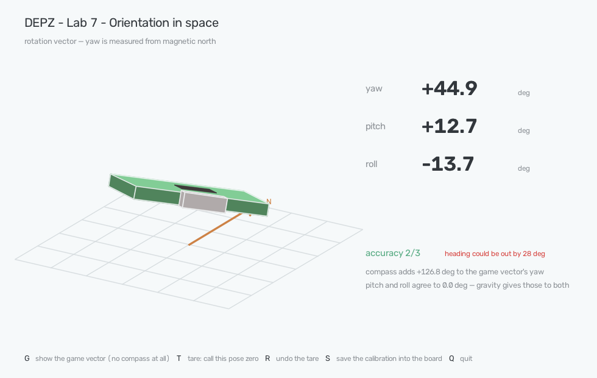
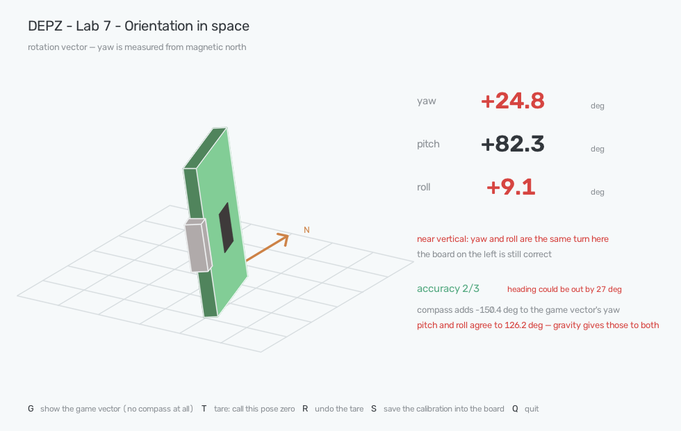

# Lab 7. Orientation in space

**Sensor:** BNO086 IMU
**What you get:** the full orientation of the board — and the two ways that
number lies to you without ever looking broken.



*What the lab shows when you run it. The green box is the board: pale side with
a chip is the component side, the grey block is the USB connector. Turn the real
one and this one follows.*

## Why

Lab 6 asked the sensor a single question — which way is down — and got an
answer that could be trusted from the first report. This lab asks the whole
question: how is the board turned, in all three directions at once.

The answer comes back as a **quaternion**: four numbers describing one rotation.
It is worth knowing what they are, but not worth dwelling on, because this lab
is not about the notation. It is about the two ways this output goes wrong while
looking perfectly healthy.

The first is that the chip does not know where north is when it starts, and says
so in a field nobody reads. The second is that the angles everyone converts the
quaternion into — roll, pitch, yaw — have a hole in them that opens up when the
board stands on its edge.

## The first report is confident and wrong

Plug the board in, ask for the rotation vector, and this arrives immediately:

```
ROTATION_VECTOR       acc=0  est=180.0 deg  q=(-0.000 +0.000 +0.893 +0.449)
GAME_ROTATION_VECTOR  acc=3  est=n/a        q=(+0.000 +0.000 +0.000 +1.000)
MAGNETOMETER          acc=0  x=+40.19 y=-30.12 z=+25.81 uT
```

Four tidy numbers. Nothing blinks, nothing throws, and converting them gives a
heading of 42.6° — a plausible-looking direction, printed to one decimal.

Beside it the chip states that this heading could be out by **180 degrees**.
That is not a warning about precision. It means the sensor has no idea which way
you are pointing and is telling you so, in `accuracy_rad`, a field that is easy
to unpack and easy to ignore:

```python
rep.accuracy       # 0..3, the fusion's own grade
rep.accuracy_rad   # estimated heading error, in radians — degrees(1.0) is 57°
```

The magnetometer explains it. Its accuracy is 0 too: the chip has three axes of
magnetic readings and no idea yet how much of that field is the Earth and how
much is the metal of the board, the desk and the laptop next to it. Until it can
separate them, north is a guess.

## Waiting does not help — and the lab proves it

The obvious response is to give it a moment to settle. Measured on the bench,
board flat and untouched:

| time | heading estimate |
|---|---|
| 0.0 s | 180.0° |
| 3.4 s | 102.4° |
| 6.9 s | 102.6° |
| 9.9 s | 102.9° |
| 10.9 s | 103.0° |

One step down as the chip notices gravity, and then it slowly gets **worse**.
Nothing about lying still tells a magnetometer which part of the field is iron.
This is what the first step of `--calibrate` is for: twelve seconds of holding
the board still, with the number on screen refusing to move, so the point is
made by the sensor rather than by a paragraph.

Movement is what pays:

| what was done | heading estimate | fusion accuracy |
|---|---|---|
| still, 0-11 s | 180° → 103° | 0 |
| first turns | 60.9° | 0 → 1 |
| 12 s of turning | 26.7° | 2 |
| best reached | **12.0°** | 2 |
| 45 s in, still turning | 42.8° | 2 |

Two things are worth taking from that table. The number that matters moved from
180° to 12° in about half a minute of turning the board through every axis — and
then drifted back out to 42° while the turning continued. Magnetic calibration
is not a task you complete; it is an estimate that follows the environment. That
last figure was measured on a desk, next to a monitor.

`accuracy 3/3` never appeared at all in 45 seconds of honest effort. If your
code waits for a 3 before it starts, it may wait forever.

## Two quaternions, and which one you actually want

The board reports two rotation vectors at once, and the lab shows both because
the difference between them is the practical lesson:

| | ROTATION_VECTOR | GAME_ROTATION_VECTOR |
|---|---|---|
| uses the magnetometer | yes | no |
| yaw is measured from | magnetic north | wherever it pointed at start |
| ready | after calibration | immediately, `accuracy 3` |
| upset by metal nearby | yes | no |
| drifts over time | no | yes, see below |

Watch them side by side and the split is unmistakable. On the bench, once the
fusion had settled, every single report had the same relationship:

```
RV   yaw  +44.9   pitch +12.7   roll -13.7
GAME yaw  -81.9   pitch +12.7   roll -13.7
                  ^^^^^^^^^^^^^^^^^^^^^^^ identical
     yaw differs by exactly 126.8°, report after report
```

Pitch and roll are identical because gravity gives them to both, and gravity
needs no calibration — that is Lab 6 all over again. The two disagree only about
yaw, and only by a constant: the angle between north and wherever the board
happened to be pointing when the game vector started. The window prints that
constant live, and it is the whole of what the compass adds.

So: if you need to know where north is — a compass app, a robot returning to a
heading — you need the fused vector and you need calibration. If you only need
*change* in orientation — a gesture, a gimbal, a controller — the game vector is
better in every way, and it is ready before you have let go of the board.

## The hole in roll, pitch and yaw

Nobody ships quaternions to a user interface. They get converted to three
angles, and that conversion is four lines:

```python
yaw   = atan2(2 * (w*z + x*y), 1 - 2 * (y*y + z*z))
pitch = asin(2 * (w*y - z*x))
roll  = atan2(2 * (w*x + y*z), 1 - 2 * (x*x + y*y))
```

The middle line is the problem. An arcsine has nowhere to go past ±90°, and
that is not a coding mistake — it is the shape of the description. Three
sequential turns cannot describe a vertical board unambiguously, because at
vertical the first turn and the last one are the same turn. Spin the board
about the vertical while it stands on edge and yaw and roll trade the change
between them; individually they are meaningless, and only their sum survives.

It is not a theoretical worry. Straight out of the bench log, two vectors
describing all but the same pose:

```
RV    pitch +82.3   roll   +9.1
GAME  pitch +83.6   roll -117.1
```

A degree apart in pitch, and 126 degrees apart in roll.



*The board standing on its edge. Pitch is 82°, and the two vectors — which agree
about the pose to within a degree — report rolls of +9° and −117°. The angles
have come apart; the box drawn from the quaternion has not.*

The window makes this visible instead of explaining it. Stand the board up and
`yaw` and `roll` turn red and start jumping — while the board drawn beside them
keeps turning smoothly, because it is drawn from the quaternion directly and
never converts to angles at all. That is the fix, too: for anything that must
survive every pose, keep the quaternion and rotate with it.

## What calibration is actually worth

`--calibrate` walks through four movements, twelve seconds each, and prints
what each one bought. On this board, on a desk:

| step | ended at | heading estimate |
|---|---|---|
| hold it still | `acc 0/3` | 119.6° |
| **one turn about the vertical** | `acc 2/3` | **16.4°** |
| nose up and nose down | `acc 2/3` | 19.7° |
| roll, then a figure-of-eight | `acc 2/3` | 16.1° |

One slow circle on the table did all of it: 120° of uncertainty down to 16°.
The figure-of-eight everyone recommends added nothing measurable, and the
nose-up step briefly made things worse.

What the chip learns can be written into its own memory, which is what the lab
does at the end of `--calibrate` (and what **S** does in the window). That is
worth doing — but do not expect it to hold:

## Calibration evaporates while the board rests

Two drift runs, both with the board lying untouched, watching `accuracy` and
the chip's own heading estimate:

| | starting estimate | after 5 minutes | accuracy |
|---|---|---|---|
| straight after power-up | 119.6° | 138.4° | 0/3 throughout |
| **straight after a full calibration** | 103.3° | 124.6° | **fell from 2 to 0** |

Both times the estimate got steadily worse, by about 4-5° per minute, and the
accuracy that calibration had earned was gone within seconds of the board
coming to rest. The fusion holds a heading while the sensor moves; a still
board gives it nothing to work with and it says so honestly.

The practical shape of that: calibrate close to when you need the heading, and
expect a device that sits still to know less about north the longer it sits.

## Drift, measured

`--drift` leaves the board alone and reports how far each yaw wandered. The
mode notices if the board is nudged and refuses to report rather than pass off
a spoiled run as a measurement.

| run | with compass | game vector (gyro only) |
|---|---|---|
| 5 minutes | 0.23° | 0.05° |
| 5 minutes, after calibrating | 0.13° | 0.03° |
| 10 minutes | **90.76°** | 0.10° |

The game vector is the steady one. Gyroscope-only heading is supposed to be the
one that drifts, and over ten minutes on a table it moved by a tenth of a
degree.

That third row is the honest oddity of this lab. Once, over ten minutes, the
fused heading swung through a right angle while the board sat still — the
compass, which is meant to hold a heading down, dragged it across the room
instead. `accuracy` was not being logged that run, and it did not happen again
in any later one, so no cause is claimed here. It is in the table because it
happened, and because a heading that can do that once should not be carrying
anything important without a check.

## Checked against physics

Two known angles, measured with `--two-poses`, which waits for the board to be
still rather than for a key to be pressed:

| what was done | true angle | game vector | with compass |
|---|---|---|---|
| turned flat on the table, against a right angle | 90° | **90.65°** | 90.65° |
| stood upright against a square edge | 90° | **89.82°** | 89.69° |

Within about half a degree either way, which is as good as the setup deserves:
the reference is a board pressed against an edge by hand, and half a degree is
what a hand is worth.

Both rows are the **total** rotation between the two poses, taken straight from
the quaternions. That matters for the second row: standing the board upright is
the gimbal-locked pose, and asking the same run for yaw gives 171° for what is
plainly a quarter turn. The decomposition falls apart; the rotation itself is
measured correctly right through it.

## Run it

```bash
.venv/bin/python labs/07_imu_orientation/lab7_imu.py              # live board in a window
.venv/bin/python labs/07_imu_orientation/lab7_imu.py --game       # ignore the compass
.venv/bin/python labs/07_imu_orientation/lab7_imu.py --calibrate  # walk through calibration
.venv/bin/python labs/07_imu_orientation/lab7_imu.py --drift 120  # leave it still, measure drift
.venv/bin/python labs/07_imu_orientation/lab7_imu.py --two-poses --truth 90   # check a known angle
.venv/bin/python labs/07_imu_orientation/lab7_imu.py --terminal   # text output, for ssh
```

In the window: **G** swaps between the two vectors, **T** tares (calls the
current pose zero, on the chip itself), **R** undoes the tare, **S** writes the
calibration into the board so the next power-up starts better, **Q** quits.
