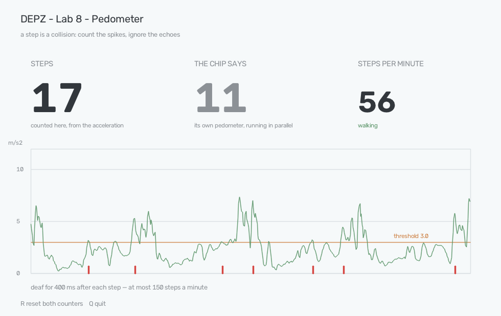

# Lab 8. A pedometer

**Sensor:** BNO086 IMU
**What you get:** a step counter you can check with your own feet — and the
point where a simple algorithm stops being enough, measured rather than
asserted.



*What the lab shows when you run it. The trace is linear acceleration, the
horizontal line is the threshold, the marks along the bottom are accepted
steps. On the left, the lab's own count; beside it, what the chip's built-in
pedometer made of the same walk.*

## Why

A step is a collision. Your foot hits the floor, the floor hits back, and for
about a tenth of a second everything you are carrying is thrown upward. The
sensor feels that as a spike, and counting steps is counting spikes.

That is one line of code, and it does not work. Two things get in the way, and
the lab is about both — plus a third thing that only shows up when you check
against your own feet, which is the reason this lab exists at the end of the
IMU series rather than the start.

## Where you carry it matters more than any parameter

The first bench walk produced nothing at all. Twenty steps down a corridor,
the chip's own pedometer counted **zero**, and the acceleration during the
walk was *quieter* than while standing still:

| | median \|a\| | peak |
|---|---|---|
| standing still | 0.95 | 2.72 |
| "walking", board in a hand | **0.62** | 2.26 |
| standing still again | 1.11 | 3.18 |

The board was being carried in a lowered hand. A hand is a suspension: the arm
swings on its own schedule and absorbs the footfall before it arrives. Nothing
about the threshold, the smoothing or the algorithm could have rescued that
recording — the steps were not in it.

The same walk with the board in a trouser pocket peaked between **5 and 29
m/s²**. For reference, the board resting on a table wanders by 0.03 m/s², with
a worst sample of 0.07.

So: three orders of magnitude between a still board and a footfall, one order
of magnitude thrown away by carrying the sensor wrong. Every number below is
for a board worn against the body.

## Two parameters, and what each one is for

```python
if smoothed > threshold and t - last_step >= refractory:
    steps += 1
```

**The threshold** separates a footfall from everything else the sensor feels —
an arm swinging, the board being put down, a door closing. Below the threshold,
a spike is not a step.

**The refractory period** — the deaf time after each accepted step — exists
because one step makes more than one spike. The heel lands, the foot rolls, the
other leg swings through. Counting every peak counts far too many.

It also sets a hard ceiling on the walk the lab can follow: 400 ms of deafness
means at most 150 steps a minute. That is a real limit, not a safety margin,
and the window prints it.

## Checked with feet, which is where it gets interesting

`--check N` takes a walk of a known length. It starts counting at the first
footfall and stops when the walking does, so there is nothing to press. Then it
prints what every setting in a sweep would have counted **on that same walk** —
one walk costs a person getting up, so it should answer the whole question.

Four walks, the same settings throughout (3.0 m/s², 400 ms):

| walk | cadence | steps taken | this lab | the chip |
|---|---|---|---|---|
| 1 | ~80/min | 20 | 22 | 16 |
| 2 | 64/min | 20 | 23 | 16 |
| 3 | 120/min | 30 | 34 | 29 |
| 4 | 78/min | 40 | **41** | **40** |

Two different failures, in opposite directions.

**This lab always overcounts**, by 2 to 15%. Extra peaks inside a single
footfall get through, and the faster the walk, the more of them there are.

**The chip undercounts on a slow walk** — 16 for 20, three times running — and
is nearly perfect on a normal one, 40 out of 40. Part of that is its warm-up:
on the first bench walk it reported nothing for the first three seconds and
then jumped straight to 2. It waits to be convinced that a rhythm is a walk,
and pays for the certainty with the first few steps. This lab counts from the
first footfall and pays for that with false positives.

Neither is wrong. They answer slightly different questions, and which one you
want depends on whether a missing step or an invented one costs you more.

## No setting works at every speed

This is the result worth taking away, and it came out of the sweep rather than
out of a book.

Settings that were exact on the slow walks — 21 counted for 20 taken, twice
running — counted **42 for 30** on a brisk one. The same code, the same
pocket, the same person, twice as many steps as were taken:

| setting | 44/min | 64/min | 120/min |
|---|---|---|---|
| 3.5 m/s², 300 ms | 21 | 21 | **42** |
| 4.0 m/s², 400 ms | 16 | 17 | 31 |
| 5.0 m/s², 300 ms | 14 | 13 | 28 |
| **3.0 m/s², 400 ms** | 22 | 23 | 34 |

Not one row is right three times. A faster footfall rings more, and a fixed
deaf time cannot know how fast you are walking — the parameter that suppresses
the ringing at 120 steps a minute is the parameter that swallows whole steps at
44.

The default settings were therefore chosen for **consistency instead of
accuracy**: 3.0 m/s² and 400 ms overcount at every speed tried, by a roughly
similar amount. A steady 13% too many is a bias you can see and allow for.
Being exact on two walks and double-counting the third is not a bias, it is a
trap.

And this is exactly why the chip's own pedometer is not two lines of code. A
real one tracks the rhythm and adapts its window to it, which is what lets it
score 40 out of 40 at one pace and 29 out of 30 at another. That is the honest
end of this lab: the simple version is worth building, because building it is
what shows you what the complicated version is for.

## Run it

```bash
.venv/bin/python labs/08_imu_pedometer/lab8_imu.py                # live count in a window
.venv/bin/python labs/08_imu_pedometer/lab8_imu.py --check 20     # walk 20, see who was right
.venv/bin/python labs/08_imu_pedometer/lab8_imu.py --threshold 4  # reject weaker spikes
.venv/bin/python labs/08_imu_pedometer/lab8_imu.py --terminal     # text output, for ssh
```

In the window, **R** resets both counters and **Q** quits. The chip's counter
cannot actually be zeroed, so the lab remembers where it was and subtracts —
the same trick as the trip meter in a car.

Carry the board in a pocket or held against your thigh. Not in a hand: see the
first section for what that costs.
